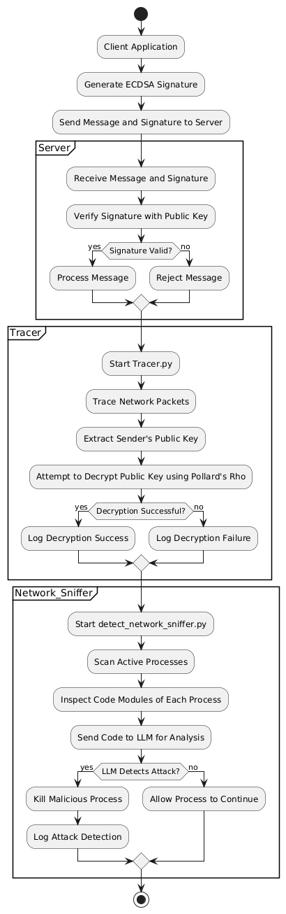

# ECDSA and Pollard's Rho Simulation

This project simulates ECDSA using the NIST256p curve and Pollard's Rho algorithm.

## Setup Instructions

### 1. Build Python Virtual Environment

First, create a virtual environment named `ecdsa_venv`:

```sh
python3 -m venv ecdsa_venv
```

Activate the virtual environment:

- On Unix or MacOS:
```sh
source ecdsa_venv/bin/activate
```

### 2. Install Requirements

Install the required packages using `pip`:

```sh
pip install -r requirements.txt
```

### 3. Run the Applications

Run the following scripts in order:

1. Run the client application:
    ```sh
    python client/app.py
    ```

2. Run the server application:
    ```sh
    python server/app.py
    ```
3. Before running further scripts, make them executable:

    ```sh
    chmod +x tracer.py detect_network_sniffer.py
    ```

4. Run the tracer script:
    ```sh
    sudo python3 tracer.py
    ```

5. Run the network sniffer detection script:
    ```sh
    sudo ecdsa_venv/bin/python3 detect_network_sniffer.py
    ```

### Note

Don't forget to include the `.env` file in the project.

## Activity Diagram

Below is the activity diagram for the ECDSA and Pollard's Rho simulation in this code:

